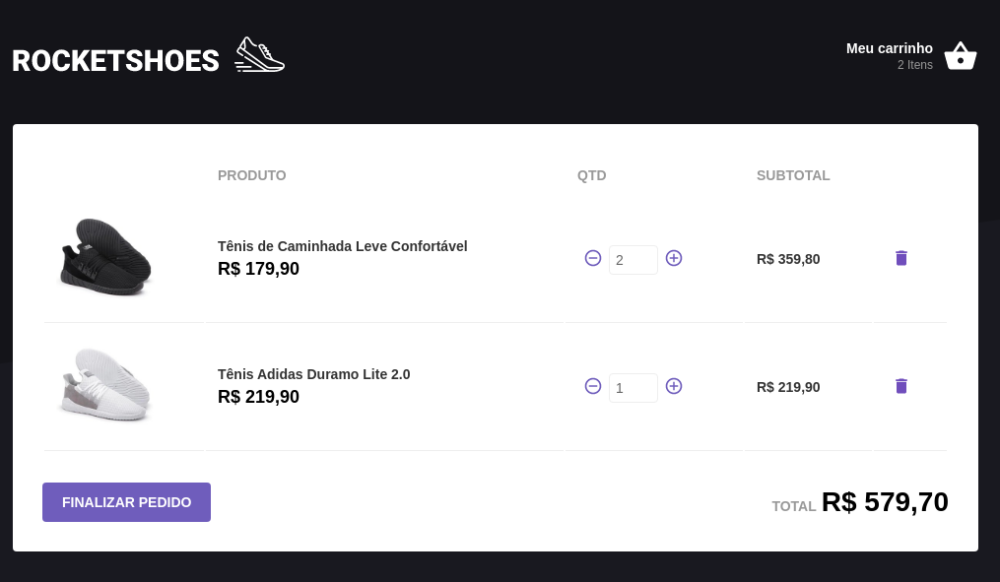

<h1 align="center">
  
</h1>

<h3 align="center">
  Rocketshoes
</h3>

## :rocket: About

Rocketshoes is an e-commerce built in ReactJS.

Some APIs and libraries used on this project:

**redux**
**redux-saga**
**react-redux**
**axios**
**history**
**immer**
****polished**
**prop-types**
**react**
**react-dom**
**react-icons**
**react-toastify**
**reactotron-react-js**
**reactotron-redux**
**reactotron-redux-saga**
**styled-components**

### Instalation ###
-- You need to have Json-server installed;

Clone the repository then:
```
yarn
```
```
json-server server.json -p 3333
```
```
yarn start
```

### Demo ###



## :memo: Guilherme Ribas
Made by Guilherme Ribas.
